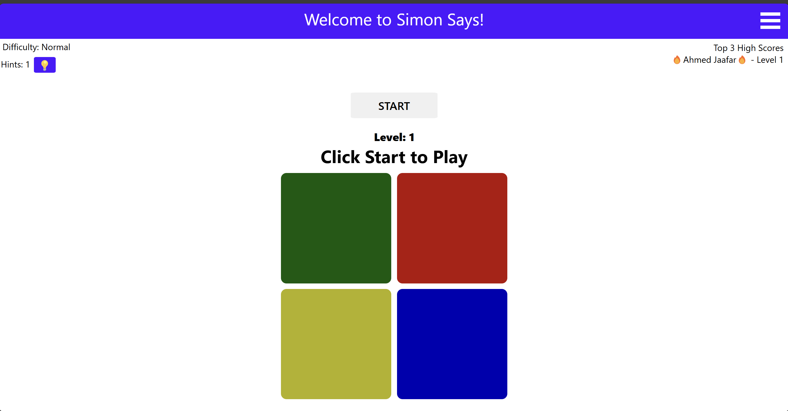
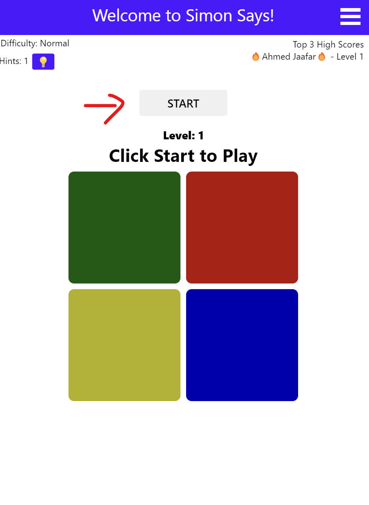
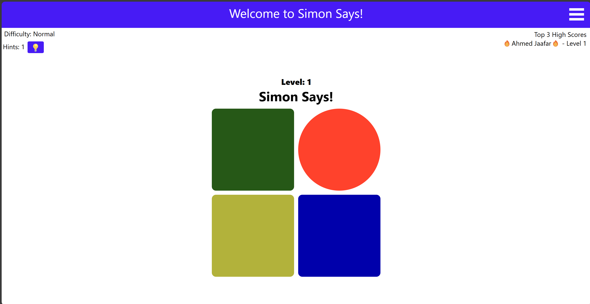
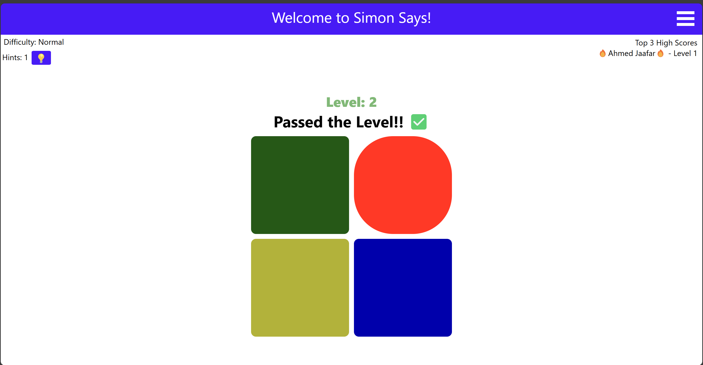

# Unit 1 Project: Simon Says

## Introduction
### Game background
Simon Says is a very popular and interesting game, the game starts by making a random sequence and the user would have to memorize the sequence and demonstrate that. The sequence gets harder and harder everytime until the user can't repeat the sequence. 
### Why Simon Says?
I chose this game because I recently fell in love with it. It was part of many people's childhood but it was something new for me. Even though it felt simple to make before starting it did offer some challenge which I enjoyed and learnt a lot from.

## Getting Started
Game link: [Simon Game](https://simon.ahmedjaffar.com)

### Game Instructions
1.  **Click on the START button to start the game.**
 

2.  **Simon will start his sequence, which you will try to memorize.** 

3. **When it's your turn you can start clicking on the squares, repeating simon's sequence which was played before you.** 

>**Tip**: If you are stuck, you can use the hints button which will play for you the rest of the sequence

4. **When you are successfull you will go to the next level as shown below.** 

## Attributions
- I've used free audio from pixabay which I trimmed to fit in the game - [Audio Download Links](soundeffects/audiosources.txt).

- I've used MDN on multiple occasions.

- for the modal I've used [W3Schools Modal Guide](https://www.w3schools.com/howto/tryit.asp?filename=tryhow_css_modal) as a base and I've built on it.

- For the Hamburger navbar I've used [Generak Assembly Reponsive Design Level Up](https://generalassembly.instructure.com/courses/557/pages/responsive-design-video?module_item_id=44792) as a base and built on it.

- For the end game I've used [W3Schools Overlay Guide](https://www.w3schools.com/howto/howto_css_overlay.asp) as a base and built on it.

